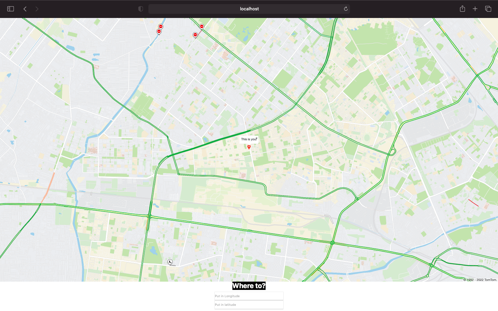
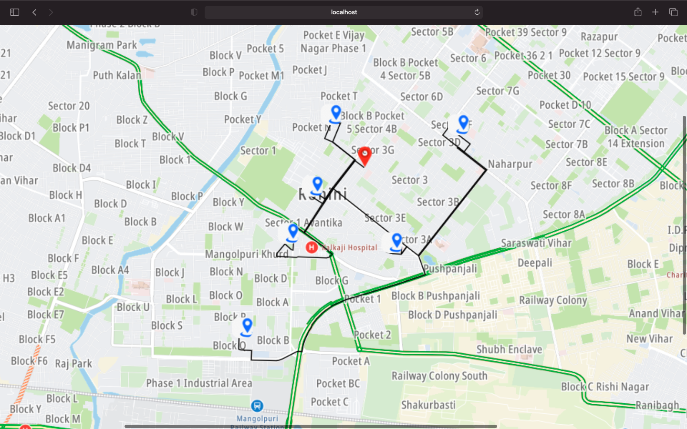

This app that will calculate the shortest distance from different spot
Using TomTom Map SDK for Web

# The route into account
### The traffic on the roads into account.
### The traffic incidents on the roads into account

### (This is the defined origin which could be changed by grabbing the pointer or adding latitude and longitude)

### (shortest distance path between places are depicted by black lines )

# Getting Started with Create React App

This project was bootstrapped with [Create React App](https://github.com/facebook/create-react-app).

## Available Scripts

In the project directory, you can run:

### `npm start`

Runs the app in the development mode.\
Open [http://localhost:3000](http://localhost:3000) to view it in your browser.

The page will reload when you make changes.\
You may also see any lint errors in the console.

